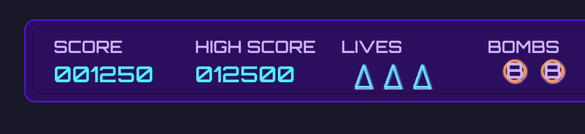
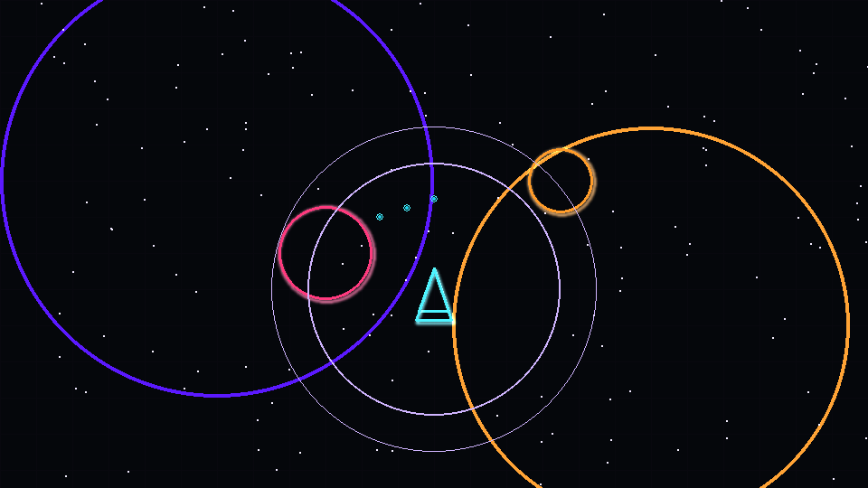
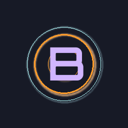

# Neon Visual Style Guide (N1.1)

## Core Palette

| Usage | Color | Hex | Notes |
| --- | --- | --- | --- |
| Player primary | Cyan pulse | `#4DF3FF` | Wireframe strokes for the ship|
| Player inner glow | Deep teal | `#1BD0E8` | Interior bloom, alpha ≤ 0.6 |
| Player highlight | Soft white | `#B4FFFF` | Wide glow for emphasis |
| Hazard primary | Magenta red | `#FF3A7E` | Enemy outlines, warning rings |
| Hazard secondary | Ember orange | `#FF9C2A` | Pickup rings, bomb wave cues |
| Hazard highlight | Warm amber | `#FFCE78` | Outer glow accent for hazards |
| HUD frame base | Royal violet | `#5612FF` | Panel outlines, button rails |
| HUD fill | Midnight violet | `#2B0F5E` | Panel backgrounds, low alpha |
| HUD shadow | Deep indigo | `#191123` | Interior stroke/drop shadow |
| Neutral base | Charcoal | `#05070B` | Playfield backdrop |
| Neutral mid | Graphite | `#171A26` | Non-interactive UI surfaces |
| Highlight text | Pale lavender | `#D0B5FF` | Copy, stat headers |

### Contrast Guidelines
- Maintain at least 3:1 contrast for text overlays (lavender text on violet panels meets this when glow is capped at alpha 120).
- Hazard tones should never share the same hue range as player cyan to preserve silhouette recognition.

## Line Weights & Glow Radii

| Context | Line Weight | Glow Radius | Notes |
| --- | --- | --- | --- |
| Micro (shots, small icons) | 1–2 px | 2–4 px | Minimal bloom, quick readability |
| Core silhouettes (player, asteroids) | 3–4 px | 6–10 px | Primary glow tier |
| HUD panels/borders | 2 px outer, 1 px inner | 6 px (outer), 2 px (inner) | Layered glow for depth |
| Event pulses (bomb, level transition) | n/a | 14–20 px | Temporary additive flash, clamp alpha ≤ 180 |

- Keep glow colors 15–20% lighter than base stroke while capping brightness to avoid bloom washout.
- Pair glow with subtle drop shadows (`1 px` offset, alpha ~90) for text and icons when rendered on dark backgrounds.

## Typography

- Primary font: Orbitron. Secondary (fallback): Pygame default sans serif.
- Weight usage: SemiBold for titles/headers, Regular for body copy.
- Recommended sizes (px at 1080p):
  - Title: 72 (tracking +20)
  - Section header: 36 (tracking +12)
  - Body: 24 (tracking +6)
  - Footnotes/controls: 18 (tracking +4)
- Apply outer glow `2 px` (alpha 120) plus optional drop shadow `1 px`, alpha 90 for readability on busy backgrounds.
- For HUD glyphs and pickup letters, render Orbitron outlines (stroke only) and let glow provide the perceived fill.

## Mockup Targets

Produce reference mockups reflecting this guide (to be linked once available):

1. HUD top panel showing score, lives, bombs with neon panel styling (outlined widgets, no solid fills).
   
2. Playfield snapshot demonstrating player wireframes, grid overlay, and hazard glow hierarchy.
   
3. Bomb pickup icon as an energized ring with orbiting highlight and glyph.
   

## Implementation Notes

- Store glow-capable assets with transparent outskirts; export at 2× resolution to allow runtime scaling without halo artifacts.
- When using additive blends, clamp composite alpha to 0.75 to prevent overexposure on stacked elements.
- Document palette values in `constants.py` once we expose them to runtime code.
- A prototype glow helper is available in `glow.py`, using smoothscale blurs and additive passes to layer base sprites with bloom effects. Favor wireframe silhouettes—feed the helper stroke-only surfaces so the bloom handles perceived fill.
